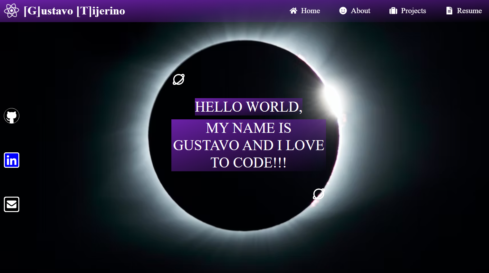

# bestDev4U

## Description

This is my portfolio to showcase my skills and knowledge of web development. I used React and Tailwind for the styling.

## Table of Contents

- [Usage](#usage)
- [Credits](#credits)
- [License](#license)
- [Contact me](#contact-me)
- [Deployed Page](#deployed-page)

## ScreenShot

## Links

[Live Page](https://gustavotijerino1.github.io/react_portfolio/)

[Github Pages](https://github.com/GustavoTijerino1/best_dev_4u/)

## License

MIT License

## Contact me

How to reach me if you have any additional questions.

[GitHub](https://github.com/GustavoTijerino1)

Email: gustavo.m.tijerino@gmail.com
